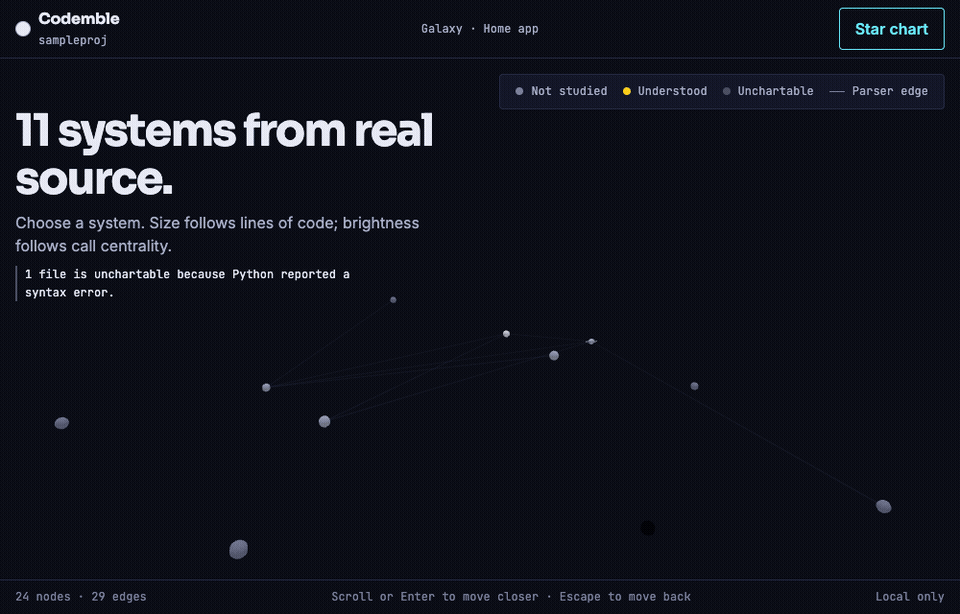

<!-- Hallmark · pre-emit critique: P5 H5 E5 S5 R5 V4 -->

<p align="center">
  <a href="https://udhawan97.github.io/Codemble/">
    
  </a>
</p>

<h1 align="center">Codemble</h1>

<p align="center"><strong>Turn AI-built code into a galaxy you actually understand.</strong></p>

<p align="center">
  Codemble is a local-first learning game for projects built with Claude Code,
  Codex, and other coding agents. It maps real parser evidence into a 3D galaxy,
  then lights each region only after you prove you understand it.
</p>

<p align="center"><strong>Your project · Your key · Your machine · No invented structure</strong></p>

<p align="center">
  <a href="https://github.com/udhawan97/Codemble/releases/latest"></a>
  <a href="https://github.com/udhawan97/Codemble/actions/workflows/ci.yml"></a>
  
  
  
</p>

<p align="center">
  <a href="#quick-start">Quick start</a> ·
  <a href="#how-the-learning-loop-works">Learning loop</a> ·
  <a href="https://udhawan97.github.io/Codemble/">Documentation</a> ·
  <a href="TESTING.md">Test v0.2.0</a>
</p>

<p align="center">
  
</p>

> [!IMPORTANT]
> **v0.3.0 is the current Phase 1 tester release.** It maps Python,
> JavaScript, TypeScript, and mixed projects in one parser-proven galaxy,
> installable straight from PyPI with an in-app project picker. The
> technical release is complete; unaided learner runs are the evidence still
> being collected. [Try the ten-minute tester loop](TESTING.md).

## Quick start

```bash
uvx codemble            # or: pipx install codemble && codemble
```

Codemble opens your browser — pick your project folder there. To skip the
picker, pass a path: `codemble ./your-ai-built-project`.

The wheel already contains the web app, so Node.js is not required. No API key is needed for the galaxy,
source viewer, language Lens, checks, lighting, or saved progress. Add your own
Anthropic or OpenAI key only if you want grounded prose explanations:

```bash
export ANTHROPIC_API_KEY=sk-ant-...   # or OPENAI_API_KEY=sk-...
```

[Installation, configuration, and troubleshooting →](https://udhawan97.github.io/Codemble/installation/)

## How the learning loop works

| Step | What Codemble does | What you gain |
| --- | --- | --- |
| **1. Chart** | Parses your project without running its code or package scripts | A deterministic map made from source evidence |
| **2. Navigate** | Guides you from galaxy → system → study on scripted camera rails | Orientation without getting lost in free flight |
| **3. Study** | Shows the real source, exact line numbers, neighbors, and parser-detected language idioms | Context tied to code you can inspect |
| **4. Prove** | Generates and scores checks from the graph—never from the model | A region lights only when understanding is demonstrated |
| **5. Return** | Saves progress locally; changing one file re-dims only its module | A living map that stays honest as the project changes |

No XP. No streaks. No leaderboard. The visible reward is the useful one: more
of your own code becomes a sky you understand.

## Read the galaxy

| In the galaxy | In your project |
| --- | --- |
| A star system | One source module |
| A planet | A function or class |
| The Home system | The selected parser-ranked entrypoint |
| A route or edge | An import or call; approximate calls are labeled **possible** |
| Size | Lines of code |
| Brightness | Structural centrality |
| Dim → lit | Not yet proven → understood |

Python-only, JavaScript-only, TypeScript-only, and mixed projects share the same
graph contract. Language focus changes only what you are looking at; it never
changes coordinates, progress, or parser truth.

## Honest by construction

Codemble is built for learners who may not yet be able to spot a confident
mistake. Accuracy therefore outranks spectacle:

- Structure, entrypoints, concepts, imports, and calls come from parsers.
- Every explanation points to a real `file:line` and may name only supplied
  identifiers and relationships.
- Language Lens notes appear only where a parser detected the construct.
- Check answers come from the graph, never an LLM.
- Approximate relationships stay visibly uncertain.
- Provider output that fails grounding validation is withheld instead of being
  softened into a guess.

Read the full [correctness contract](https://udhawan97.github.io/Codemble/correctness/).
A wrong explanation is a highest-severity bug—[report it without mercy](https://github.com/udhawan97/Codemble/issues).

## Local-first, with an explicit AI boundary

| Stays on your machine | Leaves only when you ask |
| --- | --- |
| Project discovery and parsing | The bounded Study context sent to your configured provider |
| Graph, language Lens, and checks | A request triggered only when you open Study |
| Local server and packaged web app | Nothing in the background |
| Progress and explanation cache in `~/.codemble/` | No accounts, telemetry, or Codemble cloud |

No key? Codemble remains a complete parser-backed map and learning game; only
the optional prose narration is unavailable.

## Boundaries that keep the map truthful

- **Supported source:** Python 3.11+, JavaScript/JSX, TypeScript/TSX, and mixed
  projects. Unsupported languages stay outside the graph rather than being guessed.
- **Scale:** above roughly 300 supported source files, choose a subdirectory —
  the in-app picker prompts for the scope, or pass
  `codemble --path ./project/subdirectory`.
- **Ambiguous Home:** choose a parser-ranked entrypoint in the app or pass
  `--entrypoint NODE_ID`.
- **Broken source:** syntax errors remain visible; Codemble maps safe partial
  evidence instead of crashing or inventing the missing structure.
- **Rendering:** WebGL is required. There is intentionally no misleading 2D
  fallback in this release.

## Help test the release

The most valuable contribution right now is not a feature request. It is a
first run on a real AI-built project:

1. Follow the [ten-minute tester guide](TESTING.md).
2. Light at least one system.
3. Report confusion verbatim—never paste private source or API keys.

[Open an early-tester report →](https://github.com/udhawan97/Codemble/issues/new?template=early_tester.yml)

## Develop

```bash
python -m venv .venv && source .venv/bin/activate
pip install -e ".[dev]"
pytest && ruff check .

(cd web && npm install && npm run check)
(cd docs-site && npm install && npm run check && npm run build)
```

The load-bearing design and architecture contracts are documented, not implied:

- [Architecture](https://udhawan97.github.io/Codemble/architecture/)
- [Contributing](CONTRIBUTING.md)
- [Formal Edo design system](docs-site/design.md)
- [Agent operating guide and current state](CLAUDE.md)

## Roadmap

| Horizon | Work |
| --- | --- |
| **Now** | Collect unaided first-run evidence on v0.2.0 across supported project types |
| **Next** | Go, Rust, and Java adapters; level-of-detail rendering for larger repositories |
| **Later** | Read-only share links, new quest types, and the coordinated public launch |

The [public roadmap](https://udhawan97.github.io/Codemble/roadmap/) separates
shipped work from planned work. Milestones move only when their acceptance
evidence exists.

## License

Codemble is released under the [Apache License 2.0](LICENSE).

---

<p align="center"><sub>
  Built for the moment after “AI made it work” and before “I know how it works.”
</sub></p>
